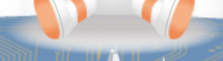

## 한화시스템 채용 사이트 클론 코딩

### 👆 기존 사이트와의 차이

###### jQuery 내 코드 및 기존 css 코드에 적용 안되는 css 재적용하기 / html구조 동일,

기존 사이트 : [한화시스템 채용공고](https://www.hanwhasystems-recruit.co.kr/?utm_source=saramin&utm_medium=cpc&utm_campaign=systems_saramin&utm_id=systemsm "한화시스템 채용공고 페이지로 이동!")

DEMO : [클론 코딩 - 한화시스템 채용공고](https://clone-hanhwasystems-recruit.netlify.app/ "클론코딩 페이지로 이동!")

### animation

@keyframes 이용

### 그림자 효과

기존 이미지=> 효과적용

 =>


```css
.headingWrap .keyvisual-wrap .shadow {
  top: 17.75rem;
  left: calc(50% - 3.45rem);
  width: 7.2rem;
  height: 1.65rem;
  animation: shadow 1s infinite alternate;
  mix-blend-mode: multiply;
}
```
